<div align="center">
  
# 🏙️ Project Northstar One — AI Sales Concierge

**Forward Deployed Engineer Assignment for Huvo AI**

[](https://nodejs.org/)
[](https://openai.com/)
[](https://expressjs.com/)

A highly deterministic, zero-hallucination conversational AI bot built to act as a premium real estate sales concierge. 

[Features](#-key-features) • [Architecture](#-system-architecture) • [Getting Started](#-getting-started) • [Testing](#-testing--deterministic-failures)

</div>

---

## ✨ Key Features

| Feature | Description |
| :--- | :--- |
| **Zero-Hallucination Guardrails** | Interpolates a single `facts.js` source-of-truth into the system prompt. Prices and specs can never drift. |
| **Native Multi-lingual** | Handles English, Hindi, and Hinglish natively via LLM reasoning without fragile backend translation layers. |
| **Deterministic Tool Calling** | Site visit bookings execute an actual tool call, passing through a custom deterministic simulator. |
| **Strict Data Extraction** | Generates session analytics via a secondary, temperature-0 LLM call enforcing strict JSON schemas. |
| **Premium Aesthetic** | Full-bleed, CSS-grid driven frontend designed as an architect's property dossier, complete with native typing animations. |

---

## 🧠 System Architecture

The backend is deliberately modular. All natural language intelligence lives in the prompt, while the backend acts as a strict orchestrator managing state, API boundaries, and deterministic side-effects.

```mermaid
sequenceDiagram
    participant User
    participant Express as Node/Express Backend
    participant LLM as OpenAI (gpt-4o-mini)
    participant Booking as Booking Simulator

    %% Chat Flow
    rect rgb(25, 30, 36)
    User->>Express: POST /api/chat { message, sessionId }
    Express->>LLM: Append history + inject facts.js + tool schemas
    
    alt Model invokes book_site_visit
        LLM-->>Express: tool_use: book_site_visit(date, time)
        Express->>Booking: simulateBooking(date, time)
        Booking-->>Express: result (success/fail)
        Express->>LLM: submit tool_result
        LLM-->>Express: natural language confirmation/apology
    else Regular Message
        LLM-->>Express: Assistant reply
    end
    Express-->>User: Render reply & custom UI cards
    end

    %% End Session Flow
    rect rgb(30, 25, 36)
    User->>Express: Click "End" -> POST /api/end
    Express->>LLM: Send history + strict JSON schema (Temp: 0)
    LLM-->>Express: Structured Analytics Object
    Express-->>User: Render Dossier Overlay
    end
```



---

## 📂 Project Structure

```text
huvo-ai-assignment/
├── .env.example          # Environment variables template
├── server.js             # Express server with fail-fast initialization
├── src/                  # Core Business Logic
│   ├── facts.js          # Single source of truth for project details
│   ├── promptBuilder.js  # Interpolates facts.js into the System Prompt
│   ├── chat.js           # Conversation loop & OpenAI Tool Calling
│   ├── booking.js        # Deterministic booking simulator
│   └── analytics.js      # Temp-0 Extraction LLM call 
├── public/               # Frontend Assets
│   ├── index.html        # Premium showroom UI layout
│   ├── style.css         # Blueprint / dossier aesthetic 
│   └── script.js         # Fetch logic and dynamic UI animations
└── test_cases.md         # Documented test scenarios & actual outputs
```

---

## 🚀 Getting Started

### 1. Prerequisites
- Node.js (v18+)
- An OpenAI API Key

### 2. Installation
Clone the repository and install dependencies:
```bash
git clone https://github.com/theshloksschauhan/huvo-ai-assignment.git
cd huvo-ai-assignment
npm install
```

### 3. Environment Setup
Copy the example environment file and insert your OpenAI API key:
```bash
cp .env.example .env
```

### 4. Run the Server
```bash
node server.js
```
Navigate to `http://localhost:3000` to start chatting with Ria.

---

## 🧪 Testing & Deterministic Failures

This bot is designed to be highly testable without relying on randomized outcomes for tool calls. 

### Triggering a Failed Booking
The `book_site_visit` tool passes through `src/booking.js`. This simulator uses a **deterministic blackout rule**: any booking requested for a **Monday** will explicitly fail.

**Try it:**
1. Express interest in a 3 BHK.
2. When prompted for a site visit, reply: *"Let's book it for next Monday at 2 PM."*
3. Watch the agent cleanly handle the failure state and attempt to reschedule you without hallucinating.

### Session Analytics
When you are done testing, click the **End** button next to the chat composer. This terminates the session, runs the extraction prompt over your transcript, and outputs the structured qualification data as a JSON dossier directly in the UI.

---
<div align="center">
  <i>Built for the Huvo AI Forward Deployed Engineer Assignment.</i>
</div>
